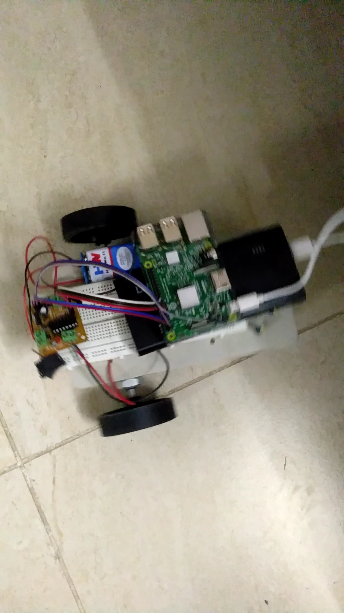
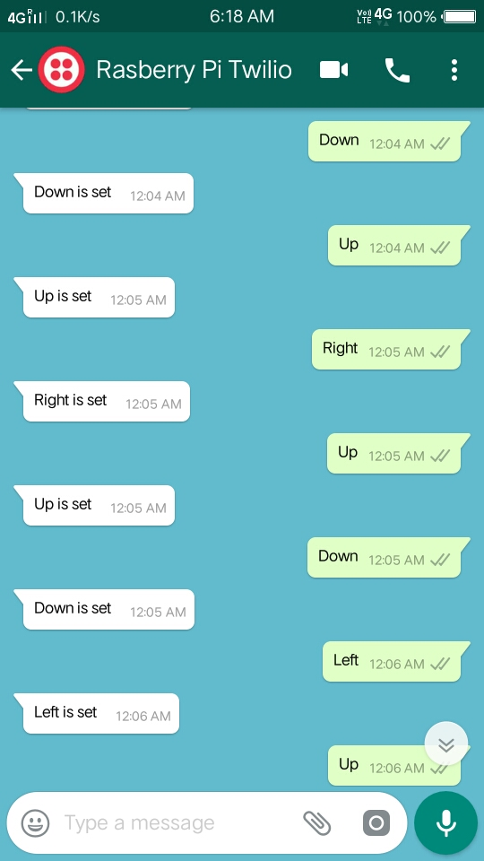

# WC-Car
A car that can control from the whatsapp messages

<b>Car image</b>
 

 
<b>Order & response</b>

 
<i>
L293D motor driver is use for motor control
 
Pins of Rasberry Pi are mention in car/rpi.py file
</i>
 
<b>Changes needs before use</b>
<ul>
	<i>In car/rpi.py file</i>
	<li>Enter host Id</li>
	<li>Enter server ip address or website</li>
	 
	<i>In server/routes/index.js</i>
	<li>Enter your account sid & authencation token in variable</li>
</ul>
 
<b>Improvments :--</b>
We can integrate this project with Dialog Flow(by Google) for more 
feature & conversation.
